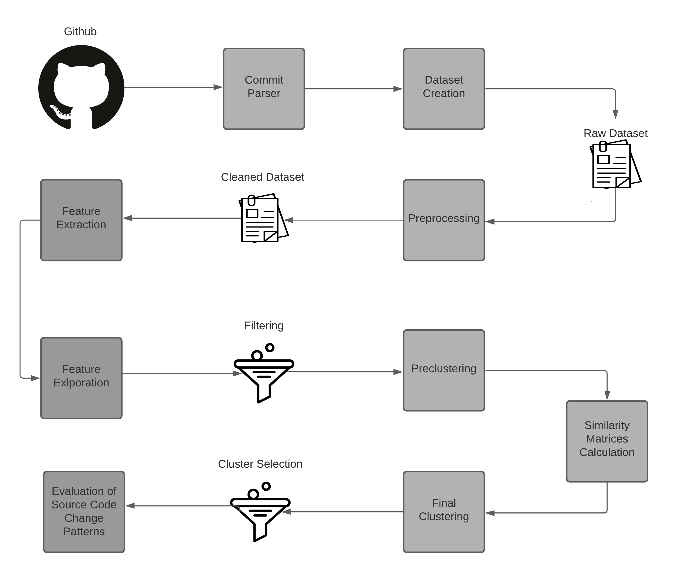

# Master Thesis
## Electrical and Computer Engineering, Aristotle University of Thessaloniki, Greece
## Intelligent Systems & Software Engineering Labgroup ([ISSEL](https://issel.ee.auth.gr/))
### Mining Source Code Changes Patterns from Open-Source Repositories 
***

#### System Design
In the following figure the system's design is depicted.

#### General Info
In the context of this thesis, we dealt with the development of an automatic source code changes patterns extraction system. 
Research is focused on clustering source code changes from high level software projects. 
For the representation of the patterns, `Abstract Syntax Trees` and `TfidfVectorizer` have been used to retain the structural
and semantic information of source code changes, respectively. The comparison of the source code fragments 
was performed with `pq-grams` and `cosine similarity` algorithms which are two methods of measuring the distance of trees
and the distance of sentences. Then the most representative source code changes of the resulting clusters were extracted and evaluated in order to be
presented as the final results.

#### Dataset Creation

To create the dataset, we use the `900 most popular Java code repositories from GitHub` based on 
their stars. In our system we focused on source code changes that are implemented in Java functions. By executing 
the two basic scripts `s1_git_clone_and_extract_shas_and_msgs.py` and `s2_extract_commits_and_their_asts.py` we create an initial training set that 
contains records with source code changes that have been implemented inside Java functions.

#### Preprocessing

For data pre-processing, we initially choose to remove any duplicates that happen inside the same commit.
Then, we separate the dataset into three different categories of source code changes: Both, Only Additions, Only Deletions.
To continue with, data preperation and feature extraction is conducted so statistical analysis and filtering of outliers can take place.
The preprocessing of the data is done by executing the scripts `s3_removing_duplicates_inside_same_commit.py` and `s4_data_preparation_and_feature_extraction.py`.

#### Preclustering

After the preprocessing of the data, an initial clustering is taking place in order to reduce the time and resource costs required for the final clustering. The initial clustering (preclustering) is based on the filtered features that created in the previous step. The preclustering is done by executing the script `s5_filtering_and_preclustering.py`

#### Clustering

For the clustering of the source code changes, two distance matrices are calculated for each of the subsets that have been 
created during the preclustering process. The comparison of source code changes is done using the algorithm pq-grams which is an approximation of the `tree
edit distance (TED` and TfidfVectorizer which is a Vector Space Modelling technique. Then, `Agglomerative Hierarchical Clustering` is performed by using the combination of the aforementioned distance matrices and the selection of the optimal number of clusters is done using the metric average silhouette. From the resulting clusters, only the best ones are selected using a number of parameters (number_of_source_code_changes, cohesion, 
repositories_per_cluster). The above procedure is performed by executing the script `s6_cosine_distance_matrix_computation.py`, `s7_inserts_deletes_distance_matrix_computation.py` and `s8_clustering.py`.

#### Source Code Changes Evaluation

For each of the selected clusters, the centroid source code change is extracted as a pattern and then it is evaluated with the aim of checking if it is widely used from developers through the test set. The specific procedure is completed with the execution of the `script s9_evaluation.py`
